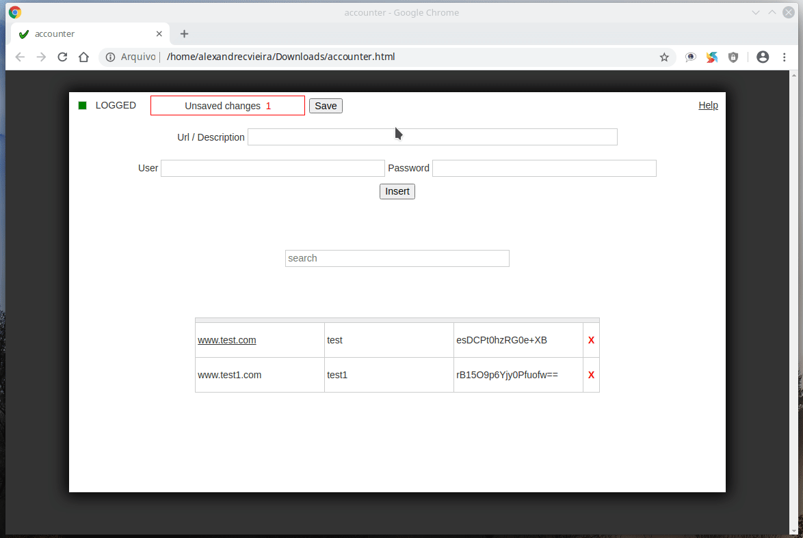
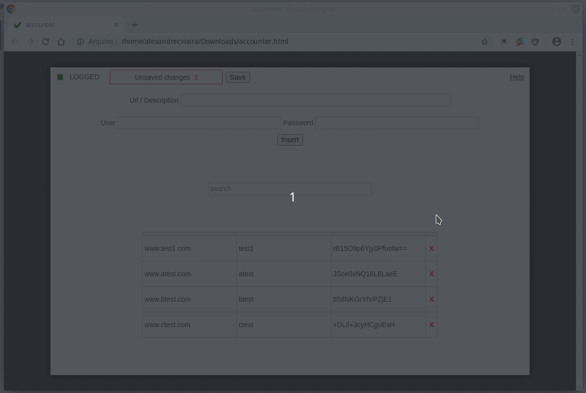
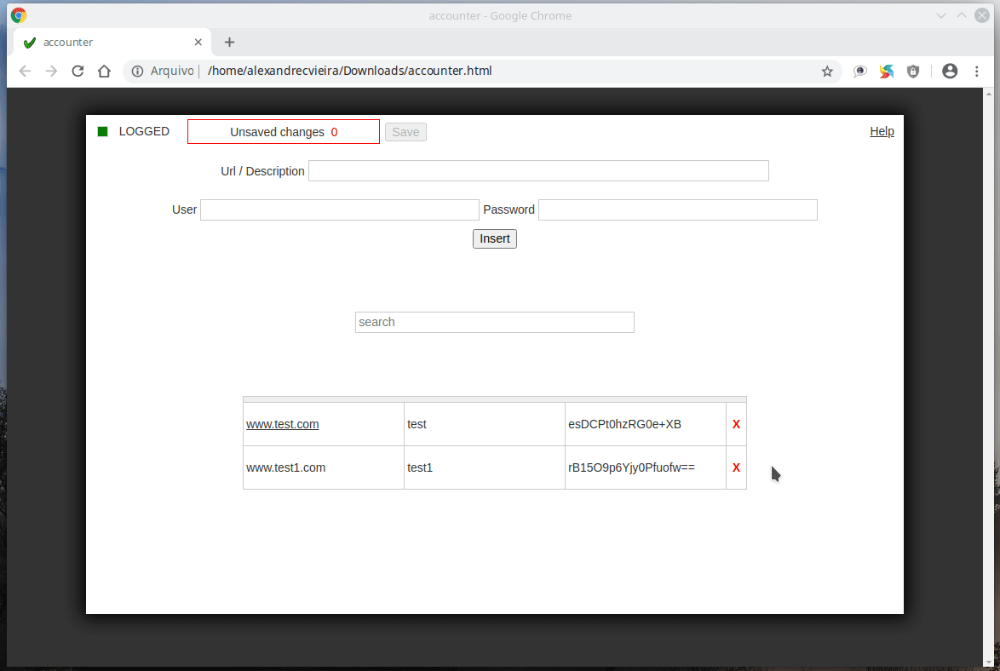

A single html file that securely stores passwords. Passwords are encrypted with a master password. Passwords are displayed by clicking on them

To Save changes click the Save button, don't attempt to use the browser **File/Save** menu option to save changes(it doesn't work)

to re-login press **F5**

To Reset Master password, enter in place of Password: **reset**

The **Secret Message** and **Authentication Data** fields are optional, they are used as additional keys to encrypt passwords

**CAUTION**: If the Master password is reset, all passwords will be lost and must be re-registered. Always have a **backup** copy of this file.

## Features

* Easy data inclusion using the browser
* Easy data query using the browser
* Case insensitive and accent insensitive search
* Accessible from mobile devices via Dropbox

## Using

### Setting the master password on first use

The "Secret Message" and "Authentication Data" fields are optional but increase encryption security, they are used as additional keys to encrypt passwords

### Inserting data

### Save data

### Search

### Delete data

### Mobile access from Dropbox

