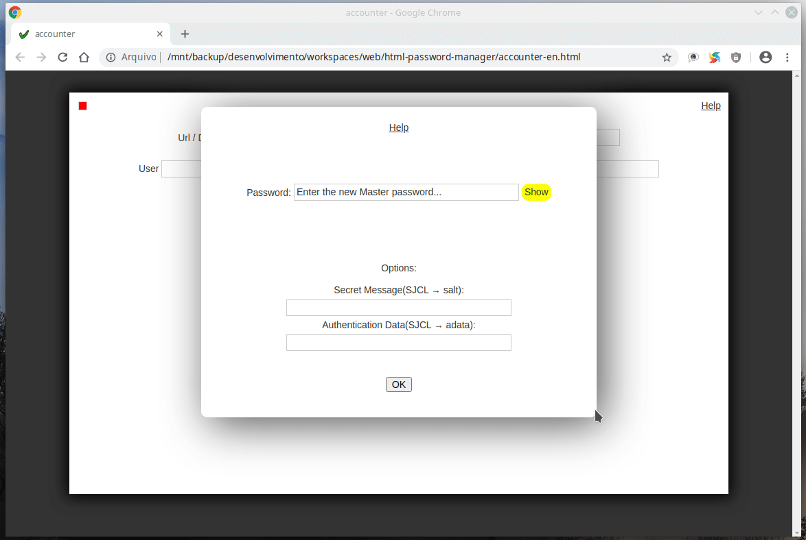
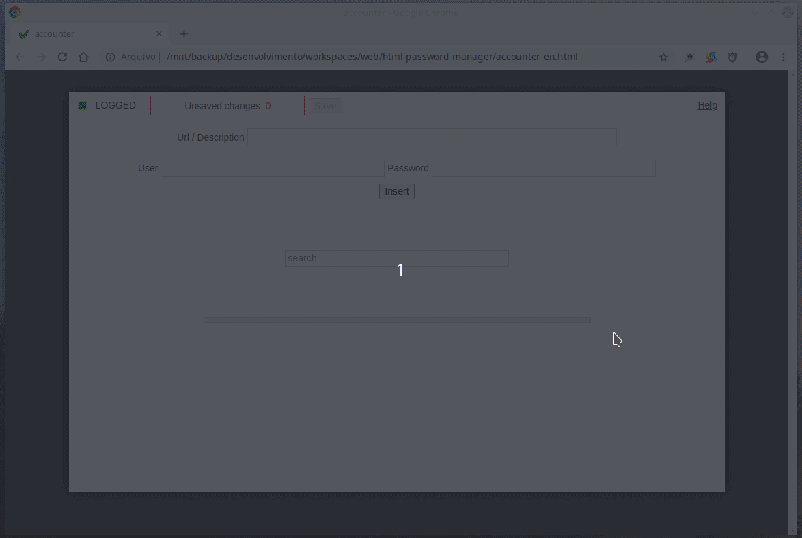

A single html file that securely stores passwords. Passwords are encrypted with a master password. Passwords are displayed by clicking on them

## Features

* Easy data inclusion using the browser
* Easy data query using the browser
* Case insensitive and accent insensitive search
* Accessible from mobile devices via dropbox

## Using

Setting the master password on first use: The "Secret Message" and "Authentication Data" fields are optional but increase encryption security, they are used as additional keys to encrypt passwords

Inserting data

